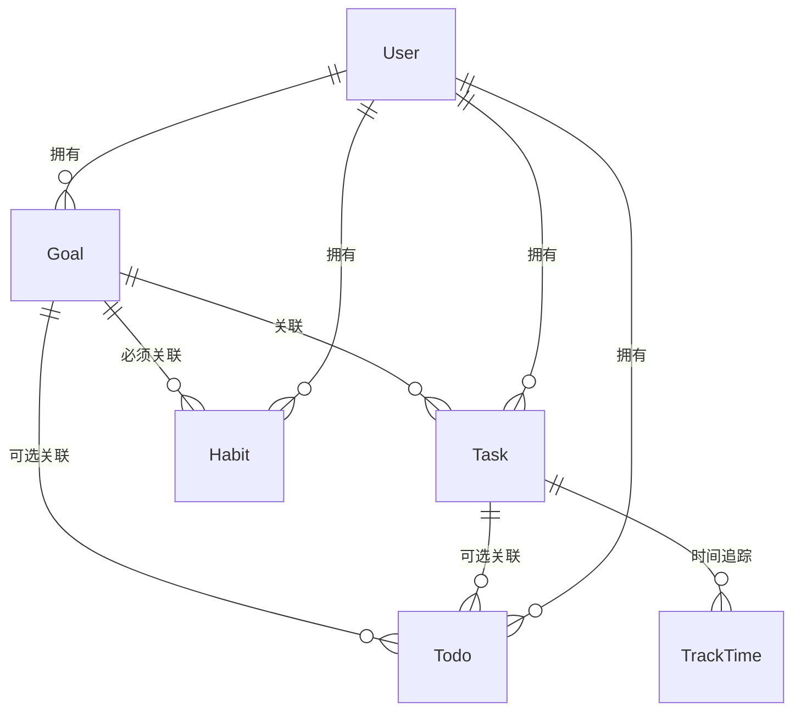
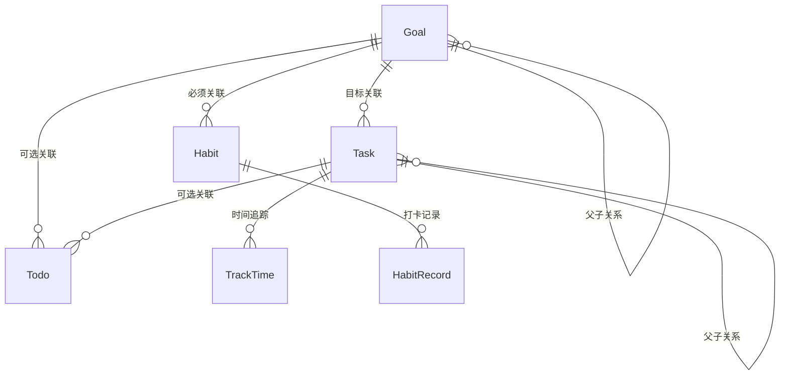
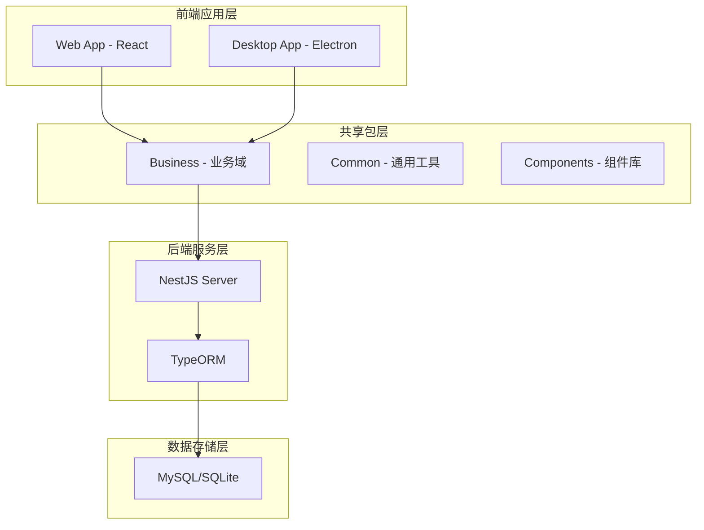

# True North 产品Wiki文档规范

## 📋 适用场景
当需要编写产品整体现状、架构概览、全局规范等产品Wiki文档时，遵循此规范确保文档结构化、全面性、可维护。ProductWiki专注于记录产品的整体架构、业务模型、技术栈、设计规范等全局性信息，为团队提供产品全貌的参考文档。

## 🎯 ProductWiki核心职责
- **产品架构**: 整体产品架构和模块关系
- **业务模型**: 核心业务逻辑和数据模型
- **技术栈**: 技术选型和架构决策
- **设计规范**: UI/UX设计标准和组件库

## 核心原则
1. **架构导向**: 专注于产品整体架构和模块关系
2. **标准化描述**: 使用统一的架构描述格式
3. **全局视角**: 从产品整体角度组织信息
4. **可追溯性**: 建立清晰的信息索引和关联关系
5. **版本管理**: 记录架构演进和变更历史

## 🏗️ 与PRD的职责边界

### ProductWiki负责 (全局性)
- 产品整体架构和模块关系
- 核心业务模型和数据结构
- 技术栈选型和架构决策
- 设计系统和组件规范
- 产品术语表和业务词汇
- 用户角色和权限体系
- 数据指标和分析体系

### PRD负责 (需求级)
- 具体功能的产品需求
- 单个功能的用户故事
- 功能级的验收标准
- 具体的交互流程设计

## 🏗️ 核心文档结构

### 一、产品概览 (必填)
```yaml
# 产品基础信息
product_overview:
  name: "True North"
  version: "v2.0"
  description: "个人成长管理工具套件"
  vision: "成为最好用的个人成长管理平台"
  mission: "帮助用户实现目标管理、习惯养成、任务规划的一体化"
  target_market: ["个人效率用户", "知识工作者", "自我管理爱好者"]
  business_model: "免费+增值服务"
  launch_date: "2024-01-01"
  current_stage: "MVP|成长期|成熟期"
```

**产品定位**: 
- 核心价值主张
- 目标用户群体
- 竞争优势分析
- 市场定位策略

**产品生命周期**:
- 当前发展阶段
- 关键里程碑
- 未来发展规划

### 二、业务架构 (必填)

#### 业务模型
```yaml
# 核心业务域
business_domains:
  - name: "个人成长"
    description: "目标、任务、待办、习惯管理"
    modules: ["goal", "task", "todo", "habit"]
    relationships: "多级联动架构"
  
  - name: "时间管理" 
    description: "时间追踪和分析"
    modules: ["track-time", "calendar"]
    relationships: "关联个人成长模块"
    
  - name: "财务管理"
    description: "个人财务记录和分析"
    modules: ["expenses", "budget"]
    relationships: "独立业务域"
```

#### 用户角色体系
```yaml
# 用户角色定义
user_roles:
  - role: "个人用户"
    permissions: ["管理个人数据", "使用基础功能"]
    limitations: ["不能访问他人数据"]
    
  - role: "高级用户"
    permissions: ["使用高级功能", "数据导出", "API访问"]
    limitations: ["有使用配额限制"]
    
  - role: "管理员"
    permissions: ["系统管理", "用户管理", "数据统计"]
    limitations: ["不能访问用户隐私数据"]
```

#### 数据模型关系


### 三、技术架构 (必填)

#### 系统架构
```yaml
# 技术栈选型
tech_stack:
  architecture: "Monorepo + 微前端"
  backend:
    framework: "NestJS"
    database: "MySQL/SQLite"
    orm: "TypeORM"
    auth: "JWT + bcrypt"
    
  frontend:
    framework: "React 18 + TypeScript"
    build_tool: "Vite"
    ui_library: ["Arco Design", "Ant Design"]
    state_management: "React Context + Hooks"
    
  desktop:
    framework: "Electron"
    build_tool: "electron-vite"
    
  package_management: "pnpm workspace"
  build_system: "Turbo"
```

#### 模块架构
```yaml
# 代码组织结构
code_structure:
  apps:
    - name: "web" 
      description: "React Web应用"
      
    - name: "desktop"
      description: "Electron桌面应用"
      
  packages:
    - name: "business"
      description: "业务域包(前后端共享)"
      subpackages: ["api", "server", "web", "vo", "enum"]
      
    - name: "common"
      description: "通用工具包"
      
    - name: "components"
      description: "可复用组件包"
```

### 四、设计规范 (必填)

#### UI设计系统
```yaml
# 设计标准
design_system:
  color_palette:
    primary: "#1890ff"
    success: "#52c41a"
    warning: "#faad14"
    error: "#f5222d"
    
  typography:
    font_family: "PingFang SC, Helvetica Neue, Arial"
    font_sizes: ["12px", "14px", "16px", "18px", "20px", "24px"]
    
  spacing:
    base_unit: "4px"
    scale: [4, 8, 12, 16, 20, 24, 32, 40, 48]
    
  components:
    button_variants: ["primary", "secondary", "ghost", "link"]
    input_types: ["text", "password", "email", "number", "textarea"]
    feedback_types: ["message", "notification", "modal", "drawer"]
```

#### 交互规范
```yaml
# 交互标准
interaction_patterns:
  navigation:
    primary: "侧边栏导航"
    secondary: "面包屑导航"
    tertiary: "Tab导航"
    
  data_display:
    list: "表格 + 卡片混合"
    detail: "抽屉 + 模态框"
    chart: "ECharts图表"
    
  form_interaction:
    validation: "实时验证 + 提交验证"
    feedback: "行内提示 + 全局提示"
    layout: "响应式表单布局"
```

#### 交互细节与页面展示
```yaml
# 模块文档必须包含的页面展示信息
interface_blueprint:
  view_matrix:
    requirement: "列出主要视图/页面、目标人群、核心亮点"
    format: "表格或结构化列表"
  layout_spec:
    requirement: "描述页面布局区域（顶部/侧边/内容/辅助区）及主要组件"
    detail_level: "突出信息架构和组件组合，而非像素级稿件"
  interaction_focus:
    requirement: "总结关键交互流程（筛选、批量操作、状态切换等）及反馈机制"
    coverage: ["输入校验", "状态提示", "快捷操作", "多视图联动"]
  responsiveness:
    requirement: "说明桌面/移动端适配策略或断点差异"
  visual_elements:
    requirement: "列出核心可视化组件（图表类型、数据要素）与展示目的"
```

### 五、业务规范 (必填)

#### 核心业务规则
```yaml
# 个人成长系统业务规则
growth_business_rules:
  goal_hierarchy:
    structure: "树形层级结构，支持无限层级"
    constraints: "子目标时间范围 ⊆ 父目标时间范围"
    
  task_association:
    rule: "二选一关联：父任务 OR 目标"
    constraint: "任务时间范围 ⊆ 关联目标时间范围"
    
  todo_flexibility:
    rule: "可选关联任务或目标"
    priority: "四象限优先级管理"
    
  habit_requirement:
    rule: "必须关联至少一个目标"
    tracking: "连续天数跟踪"
```

#### 数据约束规则
```yaml
# 数据验证规则
data_constraints:
  common_fields:
    name: "1-100字符，必填"
    description: "0-500字符，可选"
    created_at: "系统自动生成"
    updated_at: "系统自动更新"
    
  time_constraints:
    start_time: "可选，默认当前时间"
    end_time: "可选，必须大于开始时间"
    duration: "正整数，单位分钟"
    
  enum_constraints:
    importance: ["低", "中", "高", "紧急"]
    difficulty: ["简单", "中等", "困难", "极难"]
    status: "根据业务模块定义"
```

## 🔧示例模板

```markdown
# True North 产品Wiki

## 一、产品概览
```yaml
product_overview:
  name: "True North"
  version: "v2.0"
  description: "基于多级联动架构的个人成长管理工具"
  vision: "成为最智能的个人成长伙伴"
  target_users: ["效率提升用户", "自我管理爱好者", "知识工作者"]
  core_value: "通过目标-任务-待办-习惯的联动管理，实现个人成长的系统化"
```

**产品定位**: 
- 核心价值: 多级联动的个人成长管理体系
- 差异化优势: 业务逻辑深度整合，数据智能分析
- 目标市场: 追求系统化自我管理的个人用户

## 二、业务架构

### 核心业务域
```yaml
business_domains:
  growth_management:
    description: "个人成长多级联动系统"
    modules:
      - goal: "目标管理 - 树形层级结构"
      - task: "任务管理 - 二选一关联规则"  
      - todo: "待办管理 - 四象限优先级"
      - habit: "习惯管理 - 强制目标关联"
    business_rules:
      - "目标可无限层级嵌套"
      - "任务二选一关联：父任务 OR 目标"
      - "待办可选关联任务或目标"
      - "习惯必须关联至少一个目标"
```

### 数据模型关系


## 三、技术架构

### 系统架构图


### 技术选型决策
```yaml
tech_decisions:
  monorepo_architecture:
    reason: "代码复用、统一构建、依赖管理"
    tools: ["pnpm workspace", "turbo"]
    
  react_ecosystem:
    reason: "生态成熟、团队熟悉、组件丰富"
    ui_library: "Arco Design + Ant Design"
    
  nestjs_backend:
    reason: "TypeScript原生支持、装饰器模式、模块化架构"
    orm: "TypeORM - 与前端类型共享"
```

## 四、设计规范

### 设计系统
```yaml
design_tokens:
  colors:
    primary: "#1890ff"
    success: "#52c41a" 
    warning: "#faad14"
    error: "#f5222d"
    
  spacing:
    base: "4px"
    scale: [4, 8, 12, 16, 20, 24, 32, 40]
    
  typography:
    font_family: "PingFang SC, -apple-system, BlinkMacSystemFont"
    sizes: [12, 14, 16, 18, 20, 24, 32]
```

### 组件规范
- **按钮**: Primary/Secondary/Ghost/Link四种变体
- **表单**: 统一的验证规则和错误提示
- **数据展示**: Table/Card/List三种模式
- **反馈**: Message/Notification/Modal/Drawer四种类型

## 五、业务规范

### 个人成长系统规则
```yaml
growth_system_rules:
  goal_management:
    hierarchy: "无限层级树形结构"
    constraints: "子目标属性不能超出父目标限制"
    lazy_loading: "按需加载子节点，优化性能"
    
  task_management:
    association_rule: "isSubTask ? parentId : goalId"
    time_tracking: "支持开始/暂停/结束时间记录"
    
  todo_management:
    priority_matrix: "重要性×紧急性四象限分类"
    views: ["今日", "本周", "日历", "全部", "统计"]
    
  habit_management:
    goal_requirement: "必须关联至少一个目标"
    tracking_method: "连续天数统计"
```

### 数据约束规则
```yaml
validation_rules:
  time_constraints:
    goal_time_range: "子目标时间 ⊆ 父目标时间"
    task_time_range: "任务时间 ⊆ 关联目标时间"
    
  importance_constraints:
    hierarchy_rule: "子级重要程度 ≤ 父级重要程度"
    
  difficulty_constraints:
    hierarchy_rule: "子级难度 ≤ 父级难度"
```

## 🧪 典型模块蓝图示例

以下示例展示了如何在ProductWiki中沉淀全局性的业务蓝图，具体需求在PRD中只需描述差异化增量即可。

### 待办事项管理模块

```yaml
module_overview:
  name: "待办事项管理"
  domain: "个人成长/任务管理"
  objectives:
    - "提高个人任务管理效率"
    - "减少遗忘和拖延"
    - "支撑目标/任务模块的细粒度执行"
  related_entities: ["Goal", "Task", "Habit"]
  key_views: ["今日", "本周", "全部", "日历", "统计"]
```

**用户场景矩阵**:
- 主场景: 个人用户日常任务规划和执行追踪
- 次场景: 工作任务管理和进度监控
- 边界场景: 团队协作(排除)、复杂项目管理(排除)

**功能范围**:
✅ 包含: 任务创建、编辑、删除、状态管理、优先级设置、截止时间  
❌ 排除: 团队协作、文件附件、评论功能、子任务分解

**核心业务流程**:
```
用户登录 → 查看待办列表 → 创建新待办 → 设置属性 → 保存 → 执行任务 → 标记完成 → 查看统计
```

**业务规则**:
- 权限: 用户只能管理自己的待办事项
- 数据: 标题必填(1-100字符)，描述可选(≤500字符)，截止时间可选
- 状态: 待办 ↔ 完成/取消（可重新激活）

**操作流说明**:
1. 用户点击“新建待办”按钮
2. 填写标题并可选设置属性
3. 保存后待办进入“待开始”列表
4. 执行过程中可更新状态、优先级
5. 完成后记录完成时间并进入“已完成”列表

**异常处理**:
- 标题为空 → 提示“请输入任务标题”
- 网络异常 → 提示“保存失败，请重试”
- 输入超限 → 提示“标题不能超过100字符”

**界面与交互要点**:
- 布局: 顶部操作区(新建+筛选) / 主列表(卡片式) / 底部分页
- 交互: 新建/编辑弹窗、快捷完成按钮、长按/右键呼出操作菜单
- 状态反馈: 完成时展示打钩动画和完成时间

**验收指标**:
- 创建效率: 单条待办录入时间 < 30秒
- 功能完整性: 支持CRUD与状态切换
- 数据准确性: 状态/时间戳同步一致
- 用户体验: TTI < 1秒、键盘可操作、色彩对比符合标准

## 🎯 ProductWiki与PRD的协作模式

### 信息流向
1. **ProductWiki → PRD**: 提供架构约束、业务规则、设计规范
2. **PRD → ProductWiki**: 新功能完成后更新架构和规范
3. **双向同步**: 保持产品整体一致性

### 维护机制
- **定期更新**: 每个版本发布后更新ProductWiki
- **架构评审**: 重大架构变更需要更新Wiki
- **规范演进**: 设计规范变更需要同步更新

### 使用场景
- **新人入职**: 通过ProductWiki了解产品全貌
- **架构决策**: 基于Wiki中的现有架构做决策
- **功能设计**: PRD编写时参考Wiki中的规范约束
- **技术选型**: 基于Wiki中的技术栈做选择
```

## 🔄 版本管理

### 文档版本控制
- **主版本**: 产品重大架构变更
- **次版本**: 新增业务域或重要功能模块  
- **修订版本**: 规范更新和内容完善

### 变更记录
```yaml
changelog:
  v2.0.0:
    date: "2024-01-15"
    changes: ["多级联动架构确立", "Monorepo架构迁移"]
    
  v1.1.0:
    date: "2023-12-01" 
    changes: ["设计系统建立", "组件库规范化"]
```

这个ProductWiki规范专注于产品的全局性信息，与PRD形成清晰的职责分工，为团队提供完整的产品架构和规范参考。