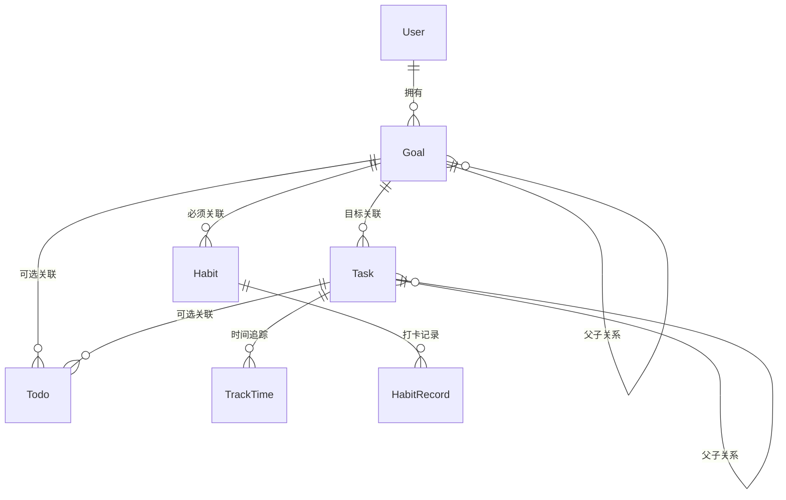

# True North ProductWiki

> 本文件作为 True North 产品的全局信息入口，描述系统级产品定位、业务域划分、技术与设计规范、以及协作与演进规则。各业务域（如 Growth）需在子目录维护域内 ProductWiki，并通过导航互相关联。

---

## 一、产品概览

```yaml
product_overview:
  name: 'True North'
  version: 'v2.0'
  description: '个人成长与生活管理工具套件'
  vision: '成为最智能、最体系化的个人成长伙伴'
  mission: '帮助用户将目标落地执行并持续复盘迭代'
  target_market: ['个人效率用户', '自我管理者', '知识工作者']
  business_model: 'Freemium + 订阅增值'
  launch_date: '2024-01-01'
  current_stage: '成长期'
```

**产品定位**

- 核心价值：目标驱动 + 执行联动 + 数据闭环
- 竞争优势：Monorepo + 多端统一体验 + 深度业务约束引擎
- 市场策略：先深耕个人成长领域，逐步扩展到协作与运营工具

**产品生命周期**

1. v1.0：构建多级联动（目标/任务/待办/习惯）
2. v1.5：引入时间追踪、统计看板
3. v2.0：AI 助手与多端统一体验

---

## 二、业务架构

```yaml
business_domains:
  - key: 'growth'
    name: '个人成长'
    modules: ['goal', 'task', 'todo', 'habit', 'track-time']
  - key: 'finance'
    name: '财务管理'
    modules: ['expenses', 'budget']
  - key: 'calendar'
    name: '日历与计划'
    modules: ['calendar', 'timer']
```

### 用户角色

| 角色     | 权限                         | 限制                 |
| -------- | ---------------------------- | -------------------- |
| 个人用户 | 管理个人数据、使用基础功能   | 无法访问其他用户数据 |
| 高级用户 | 高级分析、数据导出、开放 API | 受订阅配额限制       |
| 管理员   | 系统运营、全局配置、统计     | 不可查看用户私密内容 |

### 全局数据关系



---

## 三、技术架构

技术栈、Monorepo 布局、Desktop 分层与数据流详见 **[TechnicalWiki](../TechnicalWiki/TechnicalWiki.md)**。

```yaml
tech_stack_summary:
  monorepo: 'pnpm workspace + Turbo'
  client: 'Electron（apps/desktop）'
  ui: 'React 18 + Vite + @sue/design-web-react'
  persistence: 'TypeORM + SQLite（本地 service 层）'
  shared: '@true-north/vo / enum，packages/business'
```

---

## 四、设计与交互规范

```yaml
design_tokens:
  colors:
    primary: '#1890FF'
    success: '#52C41A'
    warning: '#FAAD14'
    danger: '#F5222D'
  typography:
    family: 'PingFang SC, -apple-system'
    sizes: [12, 14, 16, 18, 20, 24]
  spacing:
    base: 4
    scale: [4, 8, 12, 16, 20, 24, 32, 40]
```

- 导航：侧边栏 + 面包屑 + Tab
- 数据展示：表格/卡片双态，详情使用抽屉/模态
- 表单：实时校验 + 提交校验，统一错误提示
- 反馈：Message / Notification / Modal / Drawer 组合

---

## 五、业务规范（全局）

- 关联层级：Goal → Task → Todo，Habit 必须绑定 Goal
- 时间约束：子级时间范围不得超出父级
- 重要度/难度继承：子级 ≤ 父级
- 状态体系：各模块遵循未开始/进行中/完成/暂停/归档等统一语义

> 各业务域可在子级 Wiki 中扩展域内特有规则，但需引用以上全局约束。

---

## 六、域级导航

| 类型 | 文档 | 说明 |
| --- | --- | --- |
| 技术全局 | [doc/TechnicalWiki/TechnicalWiki.md](../TechnicalWiki/TechnicalWiki.md) | 工程架构与开发规范 |
| Growth（个人成长） | [doc/ProductWiki/growth/ProductWiki.md](./growth/ProductWiki.md) | 目标/任务/待办/习惯及其子模块 |
| Finance（财务） | _待建设_ | 预算、记账、统计 |
| Calendar & Timer | _待建设_ | 日历、计划、计时器 |

---

## 七、协作与版本

### 7.1 文档协作

1. 全局 ProductWiki 记录系统级产品标准；TechnicalWiki 记录工程技术标准
2. PRD 引用 ProductWiki；TDD 引用 TechnicalWiki，不复制 Wiki 全文
3. 版本迭代：先 PRD/TDD（相对 Wiki 的差异）→ 实现 → 功能入库后回写 ProductWiki / TechnicalWiki

### 7.2 版本记录

```yaml
changelog:
  - version: 'v2.1'
    date: '2026-07-24'
    highlights:
      - 'TechnicalWiki 建立，技术规范自 .cursor/rules 迁出'
  - version: 'v2.0'
    date: '2025-12-01'
    highlights:
      - 'ProductWiki 全局重构'
      - 'Growth 域模块化蓝图完成'
  - version: 'v1.0'
    date: '2024-01-01'
    highlights:
      - '多级联动 MVP 发布'
```

---

> ProductWiki 是全局唯一事实来源。如遇文档缺失或冲突，请优先更新本文件及对应域文件。
