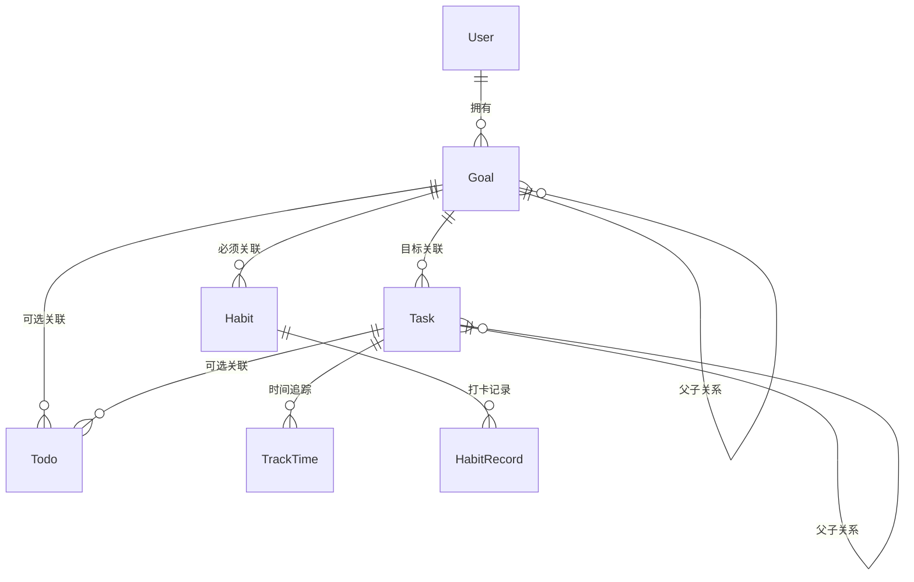

# True North 个人成长系统 ProductWiki

## 一、产品概览

```yaml
product_overview:
  name: 'True North · 个人成长系统'
  version: 'v1.0'
  description: '以目标-任务-待办-习惯多级联动为核心的个人成长套件'
  vision: '成为最智能、最体系化的个人成长管理工具'
  mission: '帮助个人将长期目标拆解为可执行事项并形成习惯'
  target_market: ['个人效率用户', '知识工作者', '自我进阶者']
  business_model: '免费增值(Freemium)+订阅扩展'
  launch_date: '2024-01-01'
  current_stage: '成长期'
```

**产品定位**

- 核心价值: 让目标驱动执行,执行沉淀为数据,数据反哺目标
- 竞争优势: 多级联动 + 统一约束引擎 + 跨终端一致体验
- 市场策略: 先聚焦 C 端深度用户,后续开放 API 与插件生态

**产品生命周期**

- 里程碑: v1 构建联动架构 → v1.5 引入时间追踪 → v2.0 释放智能推荐
- 未来规划: 协作能力、AI 助手、数据可视化工作台

---

## 二、业务架构

### 2.1 业务域概览

```yaml
business_domains:
  - name: '目标管理'
    description: '树形层级的长期目标规划'
    modules: ['goal']
    relationships: '作为所有执行实体的源头'
  - name: '任务管理'
    description: '承上启下的项目/任务分解'
    modules: ['task', 'track-time']
    relationships: '可关联目标或父任务'
  - name: '待办管理'
    description: '日常执行与优先级管理'
    modules: ['todo']
    relationships: '可关联任务/目标,也可独立'
  - name: '习惯管理'
    description: '目标驱动的长期习惯养成'
    modules: ['habit']
    relationships: '必须至少关联一个目标'
```

### 2.2 用户角色体系

| 角色     | 权限                             | 限制                 |
| -------- | -------------------------------- | -------------------- |
| 个人用户 | 管理自己的目标/任务/待办/习惯    | 不可访问他人数据     |
| 高级用户 | 个人权限 + 数据导出 + 自定义统计 | 有配额限制           |
| 管理员   | 系统运营、指标查看、配置管理     | 不可查看用户私密内容 |

### 2.3 数据模型关系



---

## 三、技术架构

实现细节见 **[TechnicalWiki](../../TechnicalWiki/TechnicalWiki.md)**（`apps/desktop`、Growth `service/growth` 等）。

```yaml
tech_stack_summary:
  app: 'apps/desktop（Electron）'
  ui: 'React 18 + Vite，render/pages/growth'
  service: 'TypeORM + SQLite，service/growth/{module}'
  shared: '@true-north/vo、packages/business/enum'
```

---

## 四、设计规范

### 4.1 设计系统

```yaml
design_tokens:
  colors:
    primary: '#1890FF'
    success: '#52C41A'
    warning: '#FAAD14'
    danger: '#F5222D'
  typography:
    family: 'PingFang SC, -apple-system, BlinkMacSystemFont'
    sizes: [12, 14, 16, 18, 20, 24]
  spacing:
    base: 4
    scale: [4, 8, 12, 16, 20, 24, 32, 40]
  elevation:
    card: '0 6px 18px rgba(0,0,0,0.08)'
```

### 4.2 交互规范

- 导航: 侧边栏(一级)、面包屑(层级)、Tab(视图切换)
- 数据展示: 表格/卡片双态,详情使用抽屉或模态
- 表单: 实时校验 + 提交校验,统一错误提示
- 反馈: Message/Notification 结合,关键操作提供二次确认

---

## 五、业务规范

### 5.1 关联规则

| 实体  | 父级关联                | 约束                            |
| ----- | ----------------------- | ------------------------------- |
| Goal  | 可选父 Goal             | -                               |
| Task  | 父任务 or 目标 (二选一) | `isSubTask ? parentId : goalId` |
| Todo  | 任务 or 目标 (可选)     | 若关联则继承约束                |
| Habit | 至少关联 1 个目标       | `goals.length >= 1`             |

### 5.2 时间&重要度约束

```
目标时间范围
    ├─ 任务时间范围 ⊆ 目标时间范围
    │   └─ 子任务时间范围 ⊆ 父任务
    └─ 待办时间范围 ⊆ 目标时间范围(若关联)

目标重要程度 ≥ 任务 ≥ 子任务
目标重要程度 ≥ 待办(若关联)
```

系统在录入/编辑/批量操作时自动校验上述约束,并通过禁用选项 + 提示信息进行引导。

### 5.3 状态体系

- Goal: `未开始/进行中/已完成/暂停/归档`
- Task: `待开始/进行中/阻塞/已完成/废弃`
- Todo: `待办/进行中/已完成/取消`
- Habit: `未开始/执行中/完成/中断`

详细状态流转参考各模块文档,PRD 中按需引用。

---

## 六、典型模块蓝图

### 6.1 目标管理

- **结构**: 树形节点 + 懒加载 + 详情抽屉
- **关键约束**: 日期/重要度/难度继承、成果/过程型分类
- **关联能力**: 关联子目标、任务、指标

### 6.2 任务管理

- **关联**: 目标或父任务二选一,支持多级子任务
- **时间追踪**: 开始/暂停/结束,可生成 track-time 数据
- **视图**: 本周、日历、全部

### 6.3 待办管理

- **视图矩阵**: 今日/本周/日历/全部/统计
- **优先级**: 四象限管理 + 标签 + 批量操作
- **统计**: 完成率、趋势、优先级分布

### 6.4 习惯管理

- **目标绑定**: 至少一个 Goal
- **打卡记录**: 连续天数、完成率、排行榜
- **提醒**: 可配置通知(规划中)

---

## 七、运营规范

### 7.1 指标体系

```yaml
metrics:
  user_engagement:
    - daily_active_users
    - weekly_retention
    - feature_adoption_rate
  growth_effectiveness:
    - goal_completion_rate
    - habit_consistency
    - todo_completion_trend
  technical:
    - api_avg_latency (<500ms)
    - availability (≥99.9%)
```

### 7.2 内容与策略

- 用户生成内容遵循《True North 内容政策》
- 系统提示语气: 友好、专业、简洁
- 重要指标按周/月节奏复盘,输出运营报告

---

## 八、协作与版本

### 8.1 文档协作

1. ProductWiki 提供全局基线 → PRD 引用并描述本版本产品差异
2. 版本迭代：PRD/TDD → 实现 → 功能入库后回写 ProductWiki / TechnicalWiki
3. README 用于导航，不承载规范内容

### 8.2 版本记录

```yaml
changelog:
  - version: 'v1.0.0'
    date: '2024-01-01'
    highlights:
      - '构建多级联动业务模型'
      - '完成 Web 端 MVP'
  - version: 'v1.1.0'
    date: '2024-06-30'
    highlights:
      - '引入时间追踪与统计看板'
      - '完成桌面端交付'
```

---

> 本 ProductWiki 为产品全局信息的唯一来源,PRD/TDD 等文档应引用本文件以保持一致性。
