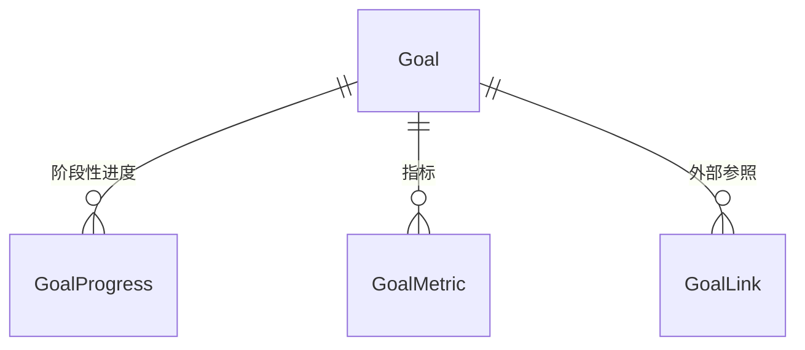

# 🎯 目标管理模块 ProductWiki

## 1. 模块概览

```yaml
module_overview:
  name: 'Goal Management'
  domain: 'Growth'
  classification: '核心业务域'
  maturity: 'GA'
  owners:
    product: '待指派'
    tech: '待指派'
  entry_points:
    - '/growth/goal'
  dependencies:
    upstream: []
    downstream: ['task', 'todo', 'habit']
```

**定位与价值**

- 提供树形层级的长期目标规划能力
- 作为所有执行实体(Task/Todo/Habit)的约束源
- 抽象统一的时间/重要度/类型约束,确保上下游一致性

**生命周期**

- 启动: 用户创建根目标或自顶向下导入
- 成长: 通过子目标拆解、进度跟踪和关联任务
- 收敛: 当目标完成/暂停/归档时触发级联校验

---

## 2. 业务架构

### 2.1 职责边界

- **必须**为任务/习惯提供可继承的业务约束
- 负责维护父子关系、类型与指标体系
- 提供跨模块可引用的目标元信息(名称、状态、时间范围、权重等)

### 2.2 关键流程

```
创建根目标 → 设置约束 → 拆分子目标 → 关联任务/指标 → 进度更新 → 状态闭环
```

### 2.3 关联关系

| 下游实体 | 关联方式                           | 约束                        |
| -------- | ---------------------------------- | --------------------------- |
| Task     | 直接关联 goalId 或继承父任务的目标 | 子任务时间/重要度 ⊆ 父目标  |
| Todo     | 可选关联 goalId                    | 若关联,需落在目标时间范围内 |
| Habit    | 至少关联一个 goal                  | 习惯完成率反哺目标进度      |

---

## 3. 技术 & 数据

### 3.1 数据模型



核心字段：

- `type`: `result|process|metric|vision|milestone`
- `importance`: 1-5
- `difficulty`: 1-5
- `timeFrame`: { startAt, endAt }
- `parentId`: 支持无限层级

### 3.2 接口契约

| API                      | 作用          | 关键参数                                  |
| ------------------------ | ------------- | ----------------------------------------- |
| `GET /goal`              | 获取树结构    | `onlyRootLevel`, `filters`                |
| `GET /goal/children/:id` | 懒加载子节点  | `parentId`                                |
| `POST /goal`             | 创建目标      | `name`, `type`, `timeFrame`, `importance` |
| `PATCH /goal/:id`        | 更新          | 局部字段                                  |
| `GET /goal/:id/related`  | 关联任务/习惯 | `include=tasks,habits`                    |

---

## 4. 设计与交互规范

### 4.1 视图矩阵（当前状态）

| 视图             | 上线状态  | 受众/场景  | 目的                       | 备注                           |
| ---------------- | --------- | ---------- | -------------------------- | ------------------------------ |
| `goal-tree`      | ✅        | 长期规划者 | 构建/浏览目标树、进行 CRUD | 单页面左树右详情结构           |
| `goal-detail`    | ✅        | 策略制定者 | 查看/编辑单目标详情        | 作为右侧面板随树节点切换       |
| `goal-dashboard` | 🚧 规划中 | 管理者     | 观测结构健康与指标         | 尚未在前端实现，保留为 roadmap |

### 4.2 布局

- 顶部：工具条（搜索、过滤器占位、创建按钮）
- 左侧：GoalAside（树组件 + 筛选 + 操作入口），支持抽屉宽度拖拽
- 右侧：GoalMain（目标详情），包含基础信息、子目标列表、关联任务/习惯概览、进度条
- 所有内容当前在一个页面中呈现，未拆分独立路由

### 4.3 交互要点（已上线）

- 树节点 hover 显示操作按钮（新增/编辑/更多），点击后在右侧面板内联编辑
- `loadChildren`：展开节点时按需请求子节点，空状态展示骨架加载
- 详情面板 Tab：概览 / 子目标 / 关联任务（与当前数据范围一致）
- 约束校验在表单内即时提示（时间/重要度），并在提交失败时 toast 反馈
- 右上角操作：刷新树、打开创建抽屉

> 规划中：拖拽排序、批量操作、历史版本等能力尚未上线，待功能落地后再补充

### 4.4 响应式策略

- 当前实现只针对桌面端（≥1200px）优化；中小屏仍加载同一布局但体验受限
- 移动端适配与 Tab 重排尚未开发，保持 TODO 记录

### 4.5 可视化元素

- 进度条：展示加权完成度（已上线）
- 关联任务/习惯计数徽章
- 状态/重要度/难度 Tag：沿用全局设计 token
- 结构热力、指标趋势等可视化组件尚未开发，将在 dashboard 视图上线时同步补充

---

## 5. 业务规则

| 规则           | 描述                                         |
| -------------- | -------------------------------------------- |
| **时间约束**   | 子目标时间范围必须完全落入父目标范围         |
| **重要度约束** | 子级 `importance` ≤ 父级                     |
| **类型约束**   | 父目标为成果型(Result)时,子目标只能是成果型  |
| **删除约束**   | 若存在关联任务/习惯需先解除或级联确认        |
| **进度算法**   | 子目标完成度加权汇总；关联任务状态可影响进度 |

---

## 6. 运营与指标

```yaml
metrics:
  structure_health:
    - name: 'active_goal_count'
      target: '按用户≥5个活跃目标'
    - name: 'avg_depth'
      target: '层级深度≤4 (避免过深)'
  execution_alignment:
    - name: 'task_goal_link_rate'
      target: '≥90%'
    - name: 'habit_goal_link_rate'
      target: '100%'
  outcome:
    - name: 'goal_completion_rate'
      cadence: '月度'
```

---

## 7. 版本记录

```yaml
changelog:
  - version: 'v1.1.0'
    date: '2025-12-15'
    changes:
      - '实现树组件懒加载'
      - '增加关联任务视图'
  - version: 'v1.0.0'
    date: '2024-06-01'
    changes:
      - '构建多级联动核心'
```

---

## 8. 协作与依赖

- **与任务模块**：`goalId` 为任务二选一关联的来源；跨文档引用 [task ProductWiki](./task.md) 中的“二选一关联规则”。
- **与待办模块**：作为高优先级待办的约束源；参见 [todo ProductWiki](./todo.md)“关联继承”章节。
- **与习惯模块**：所有习惯必须绑定至少一个目标；参见 [habit ProductWiki](./habit.md)“目标驱动”章节。
- **与全局 Wiki**：继承 `doc/ProductWiki/ProductWiki.md` 里的全局约束（时间、重要度、状态）。
- **PRD/TDD 协作**：若目标模块出现新约束，需先更新本文件，再在 `doc/growth/goal/PRD.md` 与 `TDD.md` 中补充差异实现。
