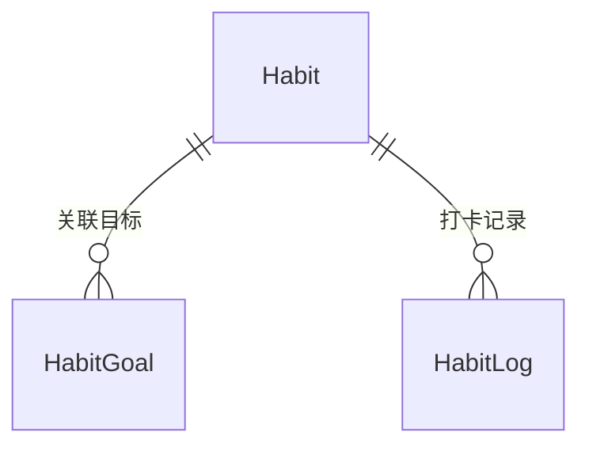

# 🔄 习惯管理模块 ProductWiki

## 1. 模块概览

```yaml
module_overview:
  name: 'Habit Management'
  domain: 'Growth'
  classification: '核心业务域'
  maturity: 'Beta'
  owners:
    product: '待指派'
    tech: '待指派'
  entry_points:
    - '/growth/habit'
  dependencies:
    upstream: ['goal']
    downstream: ['statistics', 'todo']
```

**定位与价值**

- 目标驱动的养成中心：所有习惯必须与 Goal 绑定
- 连续天数、完成率与贡献权重构成反馈闭环
- 向待办与统计模块输出可执行数据，为长期目标提供量化依据

**生命周期**

- 设定：围绕目标设计习惯，配置贡献权重与提醒策略
- 执行：每日打卡、记录心情/得分，触发待办/提醒
- 复盘：查看 streak、完成率、目标贡献，调整策略

---

## 2. 业务架构

### 2.1 职责边界

- **强制关联目标**：`goalIds.length ≥ 1`，支持多选但需至少一个活跃目标
- 沉淀习惯元信息（重要度/难度/标签/贡献权重）供统计与 AI 建议复用
- 负责 HabitLog（打卡记录）的采集与指标计算

### 2.2 关键流程

```
选择目标 → 设计习惯 → 日志打卡 → 连续天数/完成率计算 → 目标进度回写
```

### 2.3 视图矩阵

| View               | 目标     | 亮点                           |
| ------------------ | -------- | ------------------------------ |
| `habit-list`       | 日常养成 | 状态标识、连续天数、快捷打卡   |
| `habit-detail/:id` | 深度运营 | 关联目标、统计面板、日志时间线 |
| `habit-statistics` | 数据复盘 | 完成率趋势、贡献分析、排行榜   |

---

## 3. 技术与数据

### 3.1 数据模型



关键字段

- `goalIds`: string[]（必填）
- `importance` / `difficulty`: 1-5
- `contributionWeight`: 1-10（按目标维度存储）
- `currentStreak` / `longestStreak`
- HabitLog：`completionScore (perfect/good/basic/miss)`、`mood (1-5)`、`logDate`

### 3.2 API 契约

| API                         | 说明     | 核心校验                                          |
| --------------------------- | -------- | ------------------------------------------------- |
| `POST /habit`               | 创建习惯 | `goalIds` 非空、权重总和≤10×目标数                |
| `PATCH /habit/:id`          | 更新习惯 | 解绑目标后仍需≥1 目标                             |
| `POST /habit/:id/log`       | 记录日志 | `habitId + logDate` 唯一、记录时间 ⊆ 目标时间范围 |
| `GET /habit/:id/statistics` | 指标查询 | 返回 streak、完成率、趋势、贡献等                 |

---

## 4. 设计与交互规范

### 4.1 视图矩阵（当前状态）

| 视图               | 上线状态  | 受众/场景       | 目标               | 备注                                 |
| ------------------ | --------- | --------------- | ------------------ | ------------------------------------ |
| `habit-list`       | ✅        | 日常执行者      | 快速打卡与查看进度 | 卡片列表、连续天数徽章、快捷评分按钮 |
| `habit-detail/:id` | ✅        | 习惯运营者      | 深度分析单个习惯   | 在列表中点击进入详情页               |
| `habit-statistics` | ✅        | 管理者/自我复盘 | 复盘整体习惯体系   | 完成率趋势、贡献排行、streak 榜单    |
| `habit-calendar`   | 🚧 规划中 | 长期规划者      | 观察打卡密度       | 尚未上线，保留 roadmap 记录          |

### 4.2 布局

- `habit-list`：顶部筛选（目标、状态、难度、标签）+ 列表区域（自适应卡片）+ 右侧统计摘要（活跃习惯、平均 streak）
- 卡片元素：习惯名称、状态 Tag、关联目标徽章、连续天数、今日打卡按钮、心情入口
- `habit-detail`：顶部展示当前/最长 streak，下方为 Tab（概览 / 日志时间线 / 指标趋势 / 关联 Todo）
- `habit-statistics`：条件过滤器 + 图表区域（完成率、贡献、streak 排行）+ 数据表
- `habit-calendar` 尚未布局实现，待上线后补充

### 4.3 交互要点（已上线）

- 打卡按钮支持 4 档评分（完美/良好/基本/未完成），点击后即时刷新 streak
- 心情记录采用 emoji + 文本备注，同日重复编辑会提示覆盖
- 列表筛选支持多选，切换目标会刷新卡片顺序与贡献信息
- 日志时间线支持按月份折叠、无限滚动，并提供 CSV 导出
- 贡献权重编辑使用滑杆组件，保存时校验目标权重
- 统计页支持切换 7/30/90 天范围并导出图表

> 规划中：日历热力图、补记入口将在 `habit-calendar` 视图实现后补充

### 4.4 响应式策略

- ≥1200px：三列卡片 + 右侧统计栏；详情页为左右分栏
- 992-1199px：卡片两列，统计栏折叠成顶部模块
- 768-991px：卡片单列，筛选折叠为 Drawer，详情页 Tab 改顶部滑动
- <768px：仅保留核心卡片（名称、streak、打卡），详情页面全屏展示

### 4.5 可视化元素

- Streak Sparkline（已上线）：卡片展示最近 7 天打卡情况
- 完成率折线 + 心情柱状双轴图（详情/统计页）
- 贡献雷达图：展示习惯对目标的贡献比
- 状态 Tag：Active(蓝)、Paused(灰描边)、Completed(绿)、Abandoned(红)
- 日历热力图将在 `habit-calendar` 实装后补充

---

## 5. 业务规则

| 规则         | 描述                                                             |
| ------------ | ---------------------------------------------------------------- |
| **强制关联** | 创建/更新时必须确保 `goalIds.length ≥ 1`，删除目标需校验引用     |
| **日志唯一** | `habitId + logDate` 仅允许一条日志                               |
| **连续天数** | 依据最近连续非“miss”记录计算                                     |
| **状态机**   | `active → (paused/completed/abandoned)`；支持 `paused → active`  |
| **难度继承** | 习惯难度不得高于任一关联目标的难度上限                           |
| **贡献回写** | 完成打卡后按 `completionScore × contributionWeight` 回写目标进度 |

---

## 6. 指标体系

```yaml
metrics:
  engagement:
    - name: 'habit_active_rate'
      target: '≥70%'
    - name: 'avg_current_streak'
      note: '平均连续天数'
  outcome:
    - name: 'habit_completion_rate'
      cadence: '周/月'
    - name: 'goal_contribution_score'
      note: '习惯对目标进度的贡献'
  hygiene:
    - name: 'missing_log_rate'
      target: '<5%'
```

---

## 7. 版本记录

```yaml
changelog:
  - version: 'v1.1.0'
    date: '2025-09-01'
    changes:
      - '引入贡献权重与目标进度回写'
      - '上线 Habit Statistics 视图'
  - version: 'v1.0.0'
    date: '2024-08-01'
    changes:
      - '习惯创建/日志/连续天数基础能力'
```

---

## 8. 协作与依赖

- **Goal**：继承 [goal ProductWiki](./goal.md) 的时间/重要度约束，并向目标进度回写数据。
- **Task/Todo**：习惯可派生定期 Todo（规划中），需遵循 [todo ProductWiki](./todo.md) 的提醒与状态规范。
- **全局 ProductWiki**：遵循 `doc/ProductWiki/ProductWiki.md` 的状态、设计、数据规范。
- **PRD/TDD 协作**：若新增 AI 建议、多端提醒或 Habit → Todo 自动化，需先扩展本文件，再在 `doc/growth/habit/PRD.md`、`TDD.md` 中描述实现细节。
