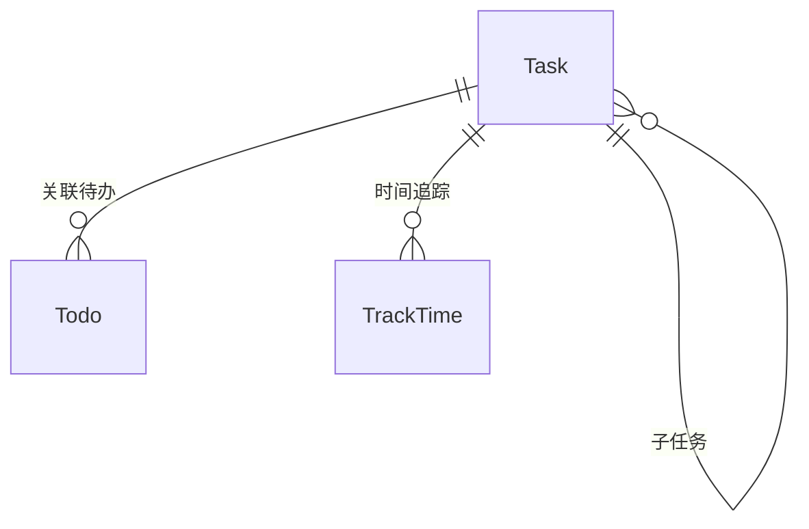

# 📋 任务管理模块 ProductWiki

## 1. 模块概览

```yaml
module_overview:
  name: 'Task Management'
  domain: 'Growth'
  classification: '核心业务域'
  maturity: 'GA'
  owners:
    product: '待指派'
    tech: '待指派'
  entry_points:
    - '/growth/task'
  dependencies:
    upstream: ['goal']
    downstream: ['todo', 'track-time']
```

**定位与价值**

- 目标拆解中枢：承接 Goal，向 Todo/Track-Time 下发执行颗粒
- 统一的约束继承节点：处理时间、重要度、难度的传递与冲突
- 执行闭环枢纽：任务状态驱动待办、时间追踪与目标进度刷新

**生命周期**

- 立项：从目标拆解或复用模板
- 执行：子任务协同 + 时间追踪
- 收敛：完成/延后/放弃并级联子任务、待办、目标

---

## 2. 业务架构

### 2.1 职责边界

- 二选一关联：`isSubTask ? parentId : goalId`
- 生成供 Todo/Habit 使用的任务元信息（重要度、标签、时间范围）
- 负责时间追踪记录（TrackTime）的归属和聚合

### 2.2 核心流程

```
选择关联（Goal / Parent Task）
  → 配置约束（时间 / 重要度 / 难度）
  → 创建子任务或待办
  → 执行 + 时间追踪
  → 状态闭环（与 Goal、Todo、统计联动）
```

### 2.3 视图矩阵

| View              | 目的       | 特色                                   |
| ----------------- | ---------- | -------------------------------------- |
| `task-week`       | 当前周执行 | 状态分组、拖拽排序、快速操作           |
| `task-calendar`   | 月度排程   | 日历拖拽、冲突提醒                     |
| `task-all`        | 全量治理   | 表格/卡片切换、筛选、批量操作          |
| `task-detail/:id` | 单任务运营 | 左树右面板、子任务/待办/TrackTime 集成 |

---

## 3. 技术 & 数据

### 3.1 数据模型



关键字段

- `isSubTask`：驱动关联逻辑
- `goalId` 与 `parentId`：互斥字段
- `timeFrame`: `{ startAt, endAt }`
- `estimatedTime` vs `actualTime`（聚合 TrackTime）
- `status`: `todo|doing|done|abandoned|blocked`

### 3.2 API 契约

| API                         | 说明     | 核心校验                                      |
| --------------------------- | -------- | --------------------------------------------- |
| `POST /task`                | 创建任务 | `isSubTask` 决定必须字段；时间/重要度继承校验 |
| `PATCH /task/:id`           | 更新任务 | 动态校验约束、触发级联刷新                    |
| `GET /task/view/:type`      | 视图数据 | 统一分页/筛选协议                             |
| `POST /task/:id/track-time` | 记录时间 | start/end 合法性 & 落入任务范围               |

---

## 4. 设计与交互规范

### 4.1 视图矩阵（当前状态）

| 视图              | 上线状态  | 受众/场景  | 目的                     | 备注                               |
| ----------------- | --------- | ---------- | ------------------------ | ---------------------------------- |
| `task-week`       | ✅        | 执行者     | 管理本周任务（分组列表） | 目前以折叠列表呈现，含右侧详情抽屉 |
| `task-calendar`   | ✅        | 排程者     | 可视化排程               | 基于月历视图，支持基本拖拽         |
| `task-all`        | ✅        | 项目经理   | 查看全量任务             | 表格/列表切换与基本筛选            |
| `task-detail/:id` | 🚧 规划中 | 个体执行者 | 独立路由详情页           | 现阶段以抽屉形式嵌在各视图中       |

### 4.2 布局

- 视图页：顶部 TabsPage + 过滤入口（状态/日期/目标暂为空位）+ 主体内容（列表/日历）+ 可选右侧详情抽屉
- `task-week`：左侧 Collapse 列表，右侧 TaskEditor 抽屉
- `task-calendar`：月历 + 选中任务详情浮层
- `task-all`：基础表格（支持筛选与分页），暂无统计侧栏

### 4.3 交互要点（已上线）

- TabsPage 与路由同步，刷新后维持在当前视图
- 任务创建/编辑通过 TaskEditor 抽屉完成，支持保存后刷新列表
- `task-week` 列表分段折叠：逾期、本周、已完成、已放弃
- 详情查看：点击列表项后右侧抽屉展示，可编辑基础信息/状态
- TrackTime 入口存在于详情抽屉但仅提供跳转占位，计时器与任务联动尚未打通
- 批量操作、拖拽排序、约束冲突高亮仍在规划阶段

### 4.4 响应式策略

- 当前实现依赖桌面宽度；中小屏会导致列表/抽屉层叠，尚未单独优化
- 后续需输出移动端信息架构再补充

### 4.5 可视化元素

- 列表内使用状态 Tag、优先级标记
- 日历视图提供任务密度提示
- 进度环、热力图、TrackTime 折线等可视化组件尚未上线，保留为后续迭代内容

---

## 5. 业务规则

| 规则                | 描述                                                    |
| ------------------- | ------------------------------------------------------- |
| **二选一关联**      | `isSubTask=true → parentId`；否则必须 `goalId`          |
| **时间约束**        | 子任务时间 ⊆ 父任务；任务时间 ⊆ 关联目标                |
| **重要度/难度约束** | 子任务 ≤ 父任务，继承目标上限                           |
| **状态机**          | `todo → doing → done/abandoned`；`blocked` 需要备注原因 |
| **自动建议**        | 当所有子任务完成时提示父任务“可完成”                    |
| **TrackTime 约束**  | 记录必须落在任务时间范围且不可重叠                      |

---

## 6. 运营指标

```yaml
metrics:
  execution_quality:
    - name: 'task_on_time_rate'
      target: '≥85%'
    - name: 'task_abandon_rate'
      target: '<10%'
  linkage_health:
    - name: 'todo_link_rate'
      target: '≥80%'
    - name: 'track_time_coverage'
      target: '≥70%'
  flow_efficiency:
    - name: 'avg_cycle_time'
      note: '创建→完成的平均耗时'
```

---

## 7. 版本记录

```yaml
changelog:
  - version: 'v1.1.0'
    date: '2025-11-30'
    changes:
      - '二选一关联校验升级（防止脏数据）'
      - '新增时间追踪入口及统计卡片'
  - version: 'v1.0.0'
    date: '2024-05-20'
    changes:
      - '首个任务中心发布，支持多视图与子任务'
```

---

## 8. 协作与依赖

- **与 Goal 模块**：继承时间/重要度约束，引用 [goal ProductWiki](./goal.md) 中的层级规则。
- **与 Todo 模块**：任务是 Todo 的主要关联源；参见 [todo ProductWiki](./todo.md) “关联继承”。
- **与 Habit 模块**：任务可向 Habit 输出可视化指标，但不强制关联；参见 [habit ProductWiki](./habit.md)。
- **与 Track-Time**：任务提供 `relatedType=task` 的时间记录归属；全局规范见 `doc/ProductWiki/ProductWiki.md`。
- **PRD/TDD 协作**：若需求新增特殊视图或状态，请先在本 Wiki 补充规则，再于 `doc/growth/task/PRD.md`、`TDD.md` 编写实现细节。
