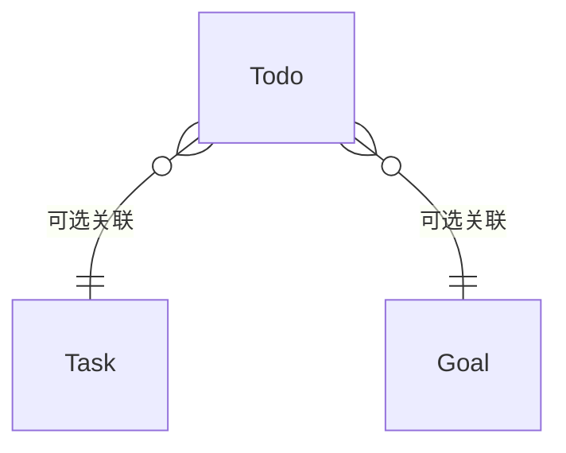

# ✅ 待办管理模块 ProductWiki

## 1. 模块概览

```yaml
module_overview:
  name: 'Todo Management'
  domain: 'Growth'
  classification: '执行层'
  maturity: 'GA'
  owners:
    product: '待指派'
    tech: '待指派'
  entry_points:
    - '/growth/todo'
  dependencies:
    upstream: ['goal', 'task']
    downstream: ['statistics', 'calendar']
```

**定位与价值**

- 承接 Goal/Task 的最小执行颗粒，负责“今日要做什么”
- 四象限优先级与多视图保证排程有序
- 行为数据回流 Dashboard 与 Habit，供效率分析

**生命周期**

- 捕获：快速创建 / 收件箱
- 调度：跨 `today/week/calendar/all` 视图
- 执行：状态流转 + 逾期提醒
- 复盘：统计视图输出趋势与效率指标

---

## 2. 业务架构

### 2.1 职责边界

- 支持“独立待办”，但若关联 Goal/Task 必须继承其时间/重要度约束
- 维护统一的优先级矩阵（重要性 × 紧急性）与提醒机制
- 输出完成率、逾期率等指标给 Dashboard／运营

### 2.2 关键流程

```
快速创建 → 视图调度（今日/周/月） → 状态流转 → 统计复盘
```

### 2.3 视图矩阵

| View             | 目标     | 关键特性                       |
| ---------------- | -------- | ------------------------------ |
| `todo-today`     | 当日执行 | 逾期标记、快捷创建、批量完成   |
| `todo-week`      | 周度排程 | 日期分组、周统计               |
| `todo-calendar`  | 长期排程 | 月历拖拽、冲突提醒             |
| `todo-all`       | 全量治理 | 表格/筛选/批量操作             |
| `todo-dashboard` | 复盘     | 完成率趋势、象限分布、效率分析 |

---

## 3. 技术与数据

### 3.1 数据模型



关键字段

- `relatedType/relatedId`: `task|goal|none`
- `importance` / `urgency`: 1-5，驱动象限
- `plannedAt` / `dueAt` / `doneAt`
- `status`: `todo|in_progress|done|abandoned`
- `reminderPolicy`: `none|time|location|habit-sync`

### 3.2 API 契约

| API                    | 说明     | 校验重点                                       |
| ---------------------- | -------- | ---------------------------------------------- |
| `POST /todo`           | 创建待办 | 若 `relatedType != none` → 时间/重要度继承校验 |
| `PATCH /todo/:id`      | 更新     | 状态流转记录 `doneAt/abandonedAt`              |
| `GET /todo/view/:type` | 视图数据 | 统一分页、筛选、分组协议                       |
| `POST /todo/batch`     | 批量操作 | 单次≤50条，需二次确认                          |

---

## 4. 设计与交互规范

### 4.1 视图矩阵（当前状态）

| 视图             | 上线状态 | 受众/场景  | 目的           | 备注                              |
| ---------------- | -------- | ---------- | -------------- | --------------------------------- |
| `todo-today`     | ✅       | 普通执行者 | 聚焦当日行动   | 逾期提示、快捷完成按钮已上线      |
| `todo-week`      | ✅       | 排程者     | 平衡本周工作量 | 日期分组、周统计卡片（基础版）    |
| `todo-calendar`  | ✅       | 长期规划者 | 可视化排程     | 支持月历视图与拖拽调整计划时间    |
| `todo-all`       | ✅       | 管理者     | 全量治理       | 表格/筛选/批量操作（批量上限 50） |
| `todo-dashboard` | ✅       | 自我复盘   | 查看效率指标   | 提供完成率趋势、象限分布等图表    |

### 4.2 布局

- TabsPage + 顶部筛选条（日期/象限/关联源）
- 列表视图：卡片列展示（标题、关联标签、日期、象限 Tag、快捷按钮）
- 详情抽屉：基础信息 / 关联信息 / 历史记录 Tab（活动流与提醒设置暂未实现）
- 统计页：顶部条件过滤 + 多图表布局 + 数据概览卡片

### 4.3 交互要点（已上线）

- 双击卡片进入详情抽屉，内联编辑后自动保存
- `todo-today` 提供批量完成/批量延期（二次确认）
- `todo-calendar` 支持拖拽 `plannedAt`，跨日拖拽调整 `dueAt`
- 逾期/即将到期：通过颜色与图标提示，hover 展示剩余时间
- 统计页默认最近 30 天，可切换 7/30/90 天范围并导出为 PNG/CSV

> 规划中：自然语言快速创建、地点提醒图标、活动流 Tab 将在后续迭代补齐

### 4.4 响应式策略

- 桌面端体验最佳；中小屏仅做基础适配（列表单列 + 抽屉覆盖）
- 移动端 Tabs 与快速操作尚未特殊优化

### 4.5 可视化元素

- 象限分布气泡图、完成率折线 + 逾期柱状图（已上线）
- 效率雷达图：展示完成率/逾期率/象限平衡
- 提醒状态图标目前仅实现时间提醒；地点/习惯同步图标待实现

---

## 5. 业务规则

| 规则           | 描述                                                                      |
| -------------- | ------------------------------------------------------------------------- |
| **关联继承**   | 若关联 Goal/Task，`plannedAt/dueAt` 必须落在父级范围，`importance ≤ 父级` |
| **优先级矩阵** | `importance × urgency` 形成象限，影响排序/标色/提醒策略                   |
| **状态机**     | `todo → in_progress → done/abandoned`，支持 `abandoned → todo` 恢复       |
| **提醒逻辑**   | `dueAt < now` 且未完成则标记逾期；支持提前提醒与重复提醒                  |
| **批量限制**   | 批量删除/状态变更需确认，系统记录操作者与时间                             |

---

## 6. 指标体系

```yaml
metrics:
  execution:
    - name: 'todo_completion_rate'
      target: '≥85%'
    - name: 'overdue_rate'
      target: '<15%'
  prioritization:
    - name: 'quadrant_distribution'
      note: '监控第一/二象限占比，预警失衡'
  efficiency:
    - name: 'avg_completion_time'
      note: 'plannedAt → doneAt 平均时长'
```

---

## 7. 版本记录

```yaml
changelog:
  - version: 'v1.1.0'
    date: '2025-10-10'
    changes:
      - '新增统计看板与象限可视化'
      - '引入 relatedType/relatedId 通用关联'
  - version: 'v1.0.0'
    date: '2024-04-15'
    changes:
      - '多视图待办中心发布（今日/周/日历/全部）'
```

---

## 8. 协作与依赖

- **与 Goal/Task**：继承时间、重要度、难度约束；参见 [goal](./goal.md)、[task](./task.md)。
- **与 Habit**：Habit 生成的打卡待办视为 `relatedType=habit` 的扩展（规划中）；当前需对接 Habit 的提醒策略。
- **与全局 Wiki**：遵循 `doc/ProductWiki/ProductWiki.md` 的状态体系与设计规范。
- **PRD/TDD 协作**：版本差异先写在 `doc/growth/todo/PRD.md`、`TDD.md`，实现完成后将仍长期有效的规则回写本 Wiki（功能入库）。
