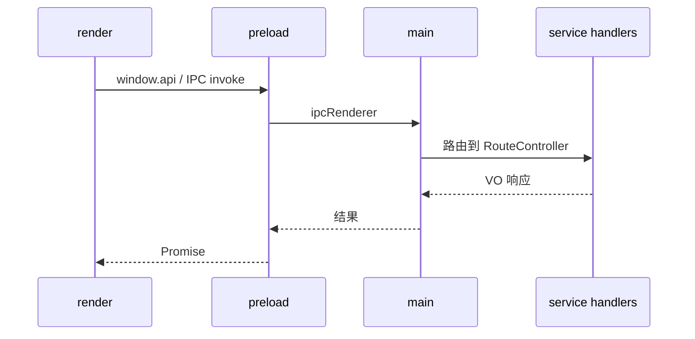

# Desktop 进程与目录分层

## 进程模型



| 目录 | 运行环境 | 职责 |
| --- | --- | --- |
| `src/main` | Node（主进程） | 创建窗口、注册 IPC、拉起 service 路由 |
| `src/preload` | 隔离上下文 | 向 `window` 暴露受控 API |
| `src/render` | Chromium | React UI、路由、模块 Context |
| `src/service` | Node（主进程侧） | TypeORM、业务 Service、RouteController |

## render 层约定

- 页面：`render/pages/{domain}/`，Growth 在 `render/pages/growth/`
- 路由：`render/router/`
- 模块状态：使用 `createInjectState`（`render/utils/createInjectState.tsx`），每功能块独立 Provider + hook
- 样式：CSS Modules + Less，与 Arco/Ant 组件配合

示例（Context 形态）：

```typescript
export const [GoalDetailProvider, useGoalDetailContext] = createInjectState<{
  PropsType: { children: React.ReactNode };
  ContextType: {
    loading: boolean;
    // ...
  };
}>(() => {
  // 状态与请求编排
});
```

## service 层约定

- 数据库：`service/db/`（`AppDataSource`、SQLite）
- 装饰器路由：`@Controller`、`@Get`、`@Post` 等（`packages/business/api`）
- 单个模块入口：`*.route-controller.ts` 暴露 HTTP 风格路径，由 IPC 层映射

## 前端页面模块（Growth）

```
render/pages/
├── growth/
│   ├── goal/
│   ├── task/
│   ├── todo/
│   ├── habit/
│   └── components/     # 跨模块详情、列表等
├── expense/
├── dashboard/
├── timer/
└── ...
```

业务规则与模块产品说明见 [ProductWiki · Growth](../../ProductWiki/growth/ProductWiki.md)。

## 相关文档

- [data-flow.md](./data-flow.md)
- [development/controller/controller-desktop.md](../development/controller/controller-desktop.md)
