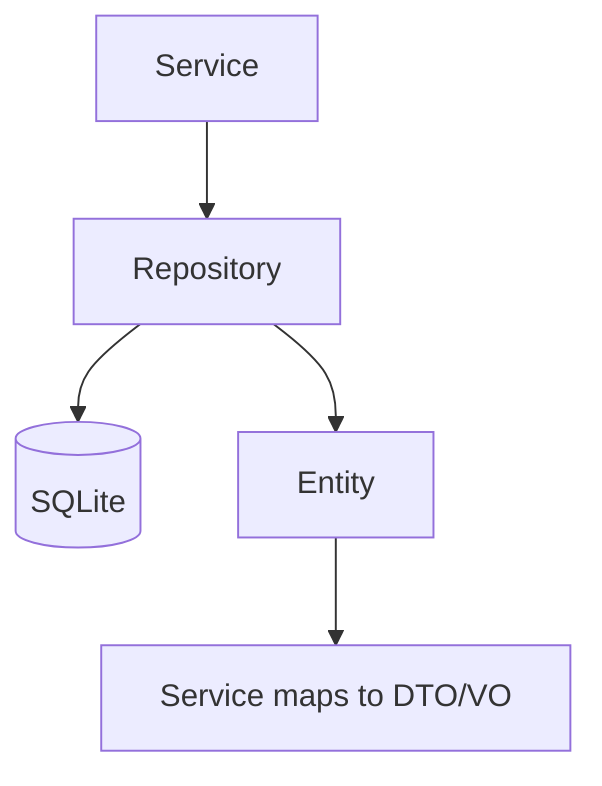

# Repository 规范

## 概述

Repository 负责 TypeORM 数据访问，位于 `apps/desktop/src/service/growth/{module}/{module}.repository.ts`。通常继承 `service/db/base.repository.impl` 中的基类，并实现模块特有查询。

## 架构

```
RouteController → Service → Repository → SQLite（TypeORM）
```

## 文件位置

```
apps/desktop/src/service/growth/{module}/
├── {module}.repository.ts      # 实现类 + 可选 interface
├── {module}.entity.ts
└── dto/
```

Desktop 实现细节见 [repository-desktop.md](./repository-desktop.md)。

## 设计原则

1. **Interface 可选**：复杂模块可声明 `{Module}Repository` interface，由实现类继承基类并 satisfies interface。
2. **Filter 驱动查询**：使用 `*FilterDto` 构建 QueryBuilder，避免在 Service 中拼接 SQL。
3. **软删除**：查询默认带 `deletedAt IS NULL`（与现网 Growth 模块一致）。
4. **DTO 边界**：Repository 返回 Entity 或内部 DTO；对外 VO 转换在 Service 或 RouteController。

## 数据流向



## 相关文档

- [repository-desktop.md](./repository-desktop.md)
- [../workflow.md](../workflow.md)
- [../../architecture/data-flow.md](../../architecture/data-flow.md)
