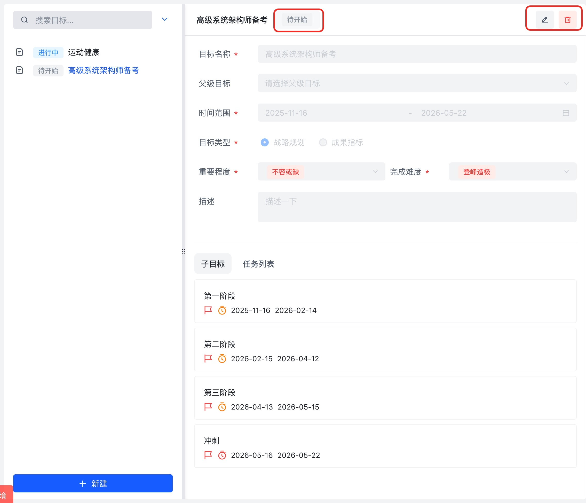

# True North v0.1.0 PRD

> 版本定位：对齐 `apps/prototype/product-wiki` 现有设计，交付基础可用的 Growth 套件 (Goal / Task / Todo / Habit) 以及共用交互骨架。本 PRD 仅描述 v0.1.0 范围，后续增量功能在模块级 PRD/TDD 中扩展。

---

## 1. 背景与目标

| 项目背景                                                                                  | 核心目标                                                                                              |
| ----------------------------------------------------------------------------------------- | ----------------------------------------------------------------------------------------------------- |
| True North 需要一个落地可用的 MVP，将 ProductWiki 中的多级联动蓝图转化为真实的 Web 体验。 | 1) 打通 Goal→Task→Todo 的核心链路；2) 统一交互/视觉规范，确保后续可扩展；3) 保持与 ProductWiki 一致。 |

关键约束：

1. **目标状态仅以 Tag 展示**（来自用户最新确认），禁止状态切换下拉。
2. **“已完成”按钮放置在右侧操作区**（详情面板右上角，与“编辑/删除/放弃”同区域）。
3. **右上角提供 `...` 按钮**，点击后弹出下拉菜单，包含“编辑 / 删除 / 放弃”三项。

---

## 2. 用户与场景

| 角色              | 需求                               | 场景                                                        |
| ----------------- | ---------------------------------- | ----------------------------------------------------------- |
| 个人规划者        | 需要拆解长期目标，查看层级关系     | 在 `goal-tree` 中创建/浏览目标树                            |
| 执行者            | 需要跟踪任务、待办、习惯的执行情况 | 通过 `task-week`、`todo-today`、`habit-list` 打卡或更新状态 |
| 管理者/自我复盘者 | 需要查看整体进度与健康度           | 使用统计页（Todo Dashboard、Habit Statistics）              |

---

## 3. 功能范围

| 模块 | 范围                                                              |
| ---- | ----------------------------------------------------------------- |
| Goal | 目标树（左侧）+ 详情面板（右侧），支持 CRUD、约束校验、操作区调整 |
| Task | 独立 Task 详情页（树 + 详情双栏）                                 |

---

## 4. 详细需求

### 4.1 Goal 模块

#### 4.1.1 目标树视图

1. 右侧 `GoalMain`：
   - 顶部显示目标名称、状态 Tag（不可编辑）、目标信息；
   - “已完成”按钮位于右上角操作区，按钮风格为主要按钮；
   - 右上角 `...` Dropdown，菜单项：编辑、删除、放弃；
   - 详情 Tab：概览 / 子目标 / 关联任务。
2. 状态展示：
   - 仅显示 Tag，无状态切换控件；
   - 状态颜色沿用 ProductWiki（灰/蓝/绿/橙/描边灰）。

#### 4.1.2 目标操作逻辑

| 操作     | 入口         | 行为                           | 校验                            |
| -------- | ------------ | ------------------------------ | ------------------------------- |
| 编辑     | `...` 菜单   | 打开右侧抽屉，内联编辑         | 时间/重要度继承校验             |
| 删除     | `...` 菜单   | 二次确认后删除                 | 禁止删除有子目标/关联实体的目标 |
| 放弃     | `...` 菜单   | 状态置为“放弃”                 | 提示用户影响                    |
| 标记完成 | “已完成”按钮 | 状态设为“已完成”，触发级联提示 | 提供撤销入口                    |

### 4.2 Task 模块

| 视图            | 需求要点                                                                          |
| --------------- | --------------------------------------------------------------------------------- |
| `task-week`     | 使用 Collapse 展示逾期/本周/已完成/已放弃，点击任务在右侧抽屉展示详情并支持编辑。 |
| `task-calendar` | 月历拖拽计划时间，点击日程弹出任务摘要，可进入详情抽屉。                          |
| `task-all`      | 表格视图，提供基础筛选（状态/关联目标），支持分页。                               |

详情抽屉须包含：概览、子任务、关联待办、TrackTime 入口（暂为占位）。TrackTime 与任务联动仅提供“跳转”按钮，无自动计时。

#### 4.2.1 Task 详情页（新增）

1. **布局**：左侧 Task 树（父/子任务层级，与 Goal 页面的表现保持一致）+ 右侧 Task 详情面板。
2. **入口**：
   - 在 Task 模块的任意视图（week/calendar/all）中点击“查看详情”按钮，可跳转到 `/growth/task/detail/:id`。
   - Goal 详情页的“关联任务”列表项点击后也跳转至该 Task 详情页，保持上下游联动。
3. **左侧 Task 树**：
   - 默认定位到当前任务节点，并展开其父链；
   - 支持搜索/过滤（状态、负责人）占位；
   - 节点点击后，右侧详情同步更新。
4. **右侧 Task 详情**：
   - 顶部区域沿用 Goal 详情的模式：状态 Tag（只读）+ `...` 菜单（编辑、删除、放弃）+ 主要按钮（“标记完成”或“恢复”等）；
   - Tab 结构：概览 / 子任务 / 关联 Todo / TrackTime；
   - 支持子任务内联创建、状态更新、时间校验提示。
5. **跳转行为**：
   - Goal 页面“关联任务”列表点击 → 打开新标签/同页跳转到 Task 详情，并在 Task 树中高亮对应节点；
   - 从 Task 详情返回 Task 视图时，需保留前一次的筛选和滚动状态。

---

## 5. 交互与视觉规范

| 元素       | 规范                                                           | 备注               |
| ---------- | -------------------------------------------------------------- | ------------------ |
| 状态 Tag   | 仅展示，无切换；颜色参照 ProductWiki design tokens             |                    |
| 右侧操作区 | 从左到右：状态 Tag、`...` 下拉、主要按钮（如“已完成”或“完成”） |                    |
| Dropdown   | 采用 `@sue/design-web-react` `Dropdown`，菜单项：编辑、删除、放弃（Goal） | 删除操作需加危险色 |
| 按钮       | 主要按钮用于完成/保存，次要/文字按钮用于辅助操作               |                    |

---

## 6. 附录

- 设计稿：参考 `apps/prototype/product-wiki/growth` 各模块的视图矩阵与交互描述。
- 截图说明：目标详情页右上角状态 Tag + “已完成”按钮 + `...` 操作菜单
